🧽 The foam augmentation slicer web app .

# How to use
1. **Import the Model**
Click `Import Everyday STL Model` and select an `stl` file to import. The app should load the model into the center of the print bed automatically. You can move it around and scale/rotate it however you'd like in the transform folder of the model.

    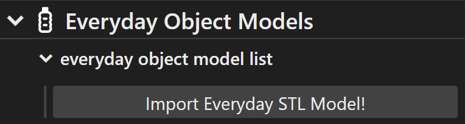

2. **Change the Print Parameters**
- Either import a preset by pressing `Import Preset` under the `Presets` folder or change the various parameters under the imported model's folder to get your desired results. You can see descriptions of each of the parameters below under the **Print Parameters** section.
- If you don't want to have to set all the parameters again in the future, press `Export Preset` under the `Presets` folder so you can import them easily in the future.

  <table>
    <tr>
      <td align="center">
          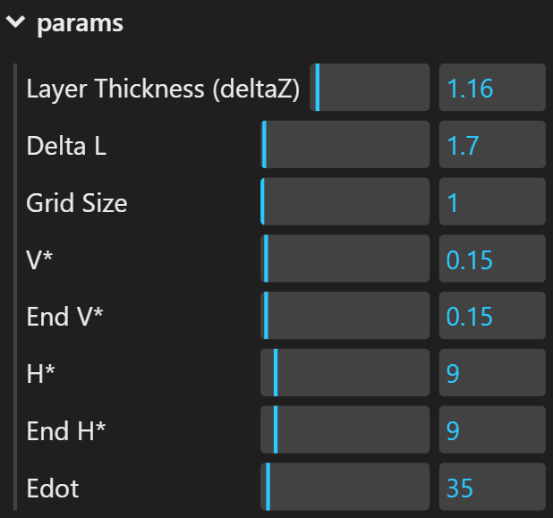 
        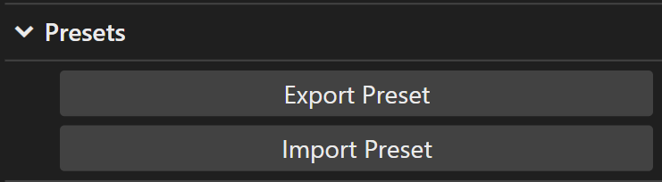
      </td>
      <td align="center">
        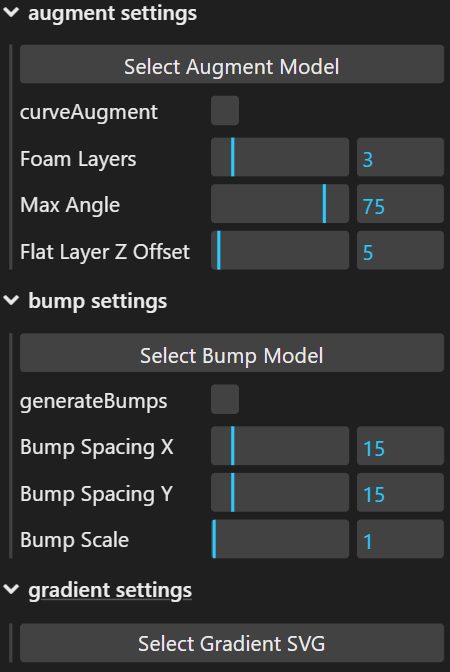
      </td>
    </tr>
  </table>

3. **Generate the Toolpath**
- For augmentation, position your camera above the model looking directly down at it, then press `Select Regular Foam Area` under the model you want to augment, then hold `alt` (windows) or `option` (Mac) and draw with left cursor down to use lasso or rectangular selection to select part of the mesh. This may take a second, but after you wait you should see a visualization show up.

    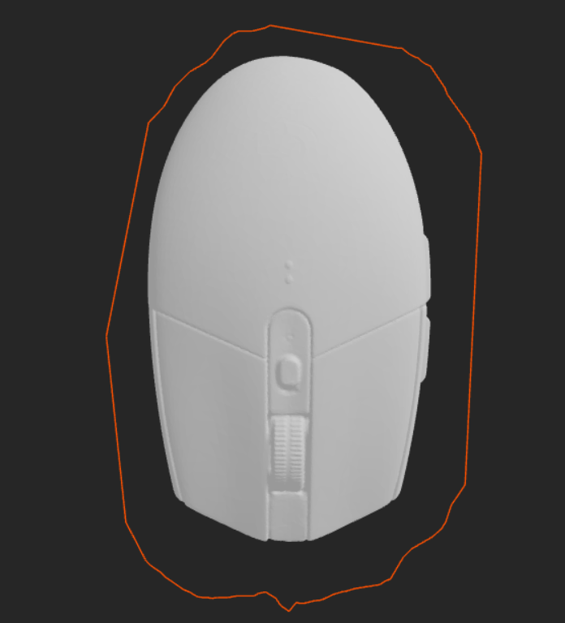
    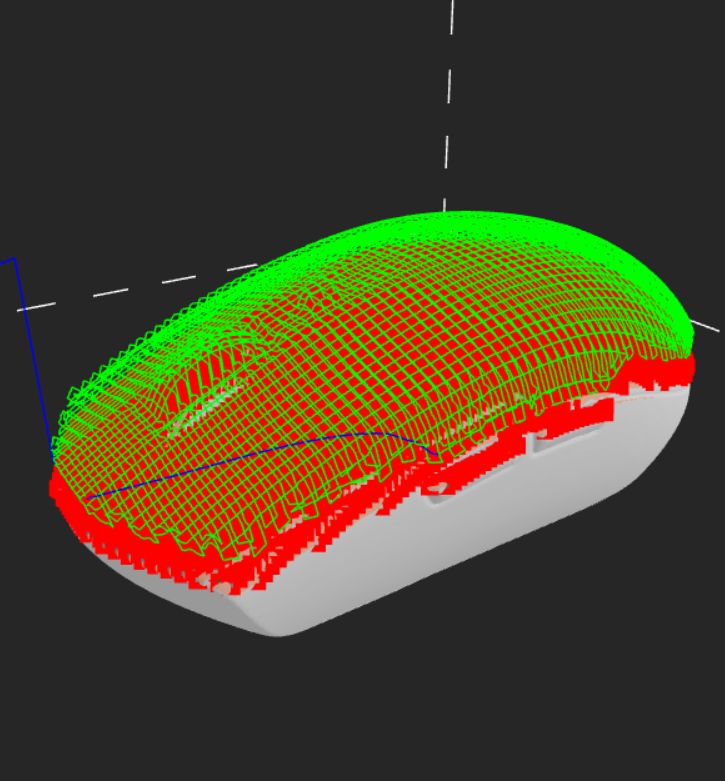

- For foam slicing, press `Slice Plate` under the `Foam Slicing` folder. With this, you should be prompted to save the G-Code and see a visualization show up after it's done slicing.

    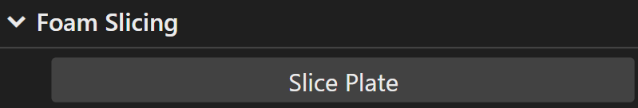 
    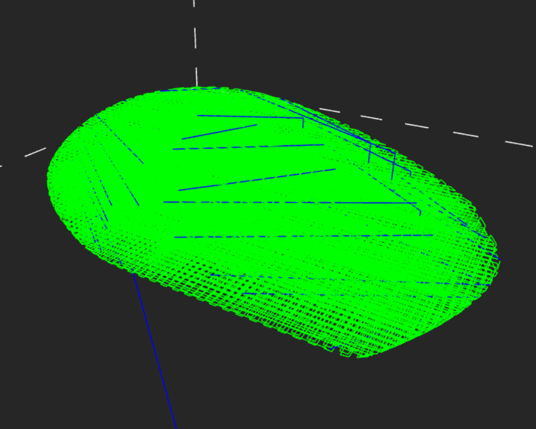

4. **Save the G-Code**
- Hit the `Save toolpath G-Code` button under the `Saving` folder to download the gcode file for the foam printing toolpath. The G-Code should have already automatically downloaded if you did foam slicing rather than augmentation.

    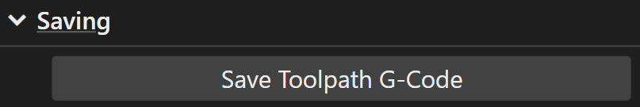

# Other Features

**Curved Augmentation** 
Instead of just generating a regular augmentation, you can also make one that has any top surface you want! With this you can flatten out the surface of any object so you can print regularly on it or you can print any shape you want onto the object your augmenting.

    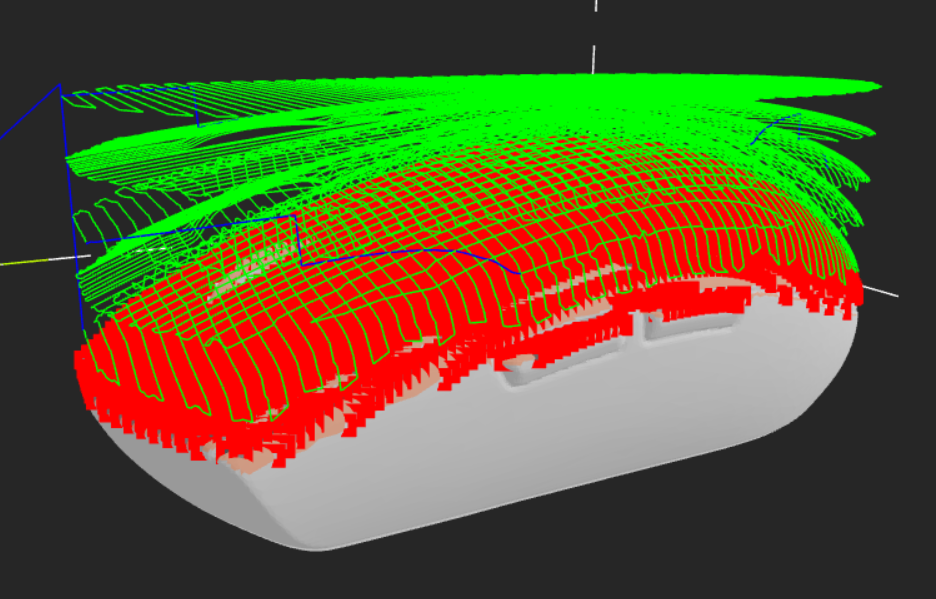

**Foam Gradients** 
You can make foam gradients on the x and y axes using an SVG file. This way, if you want to have different properties of the foam in different locations, you can do that.

    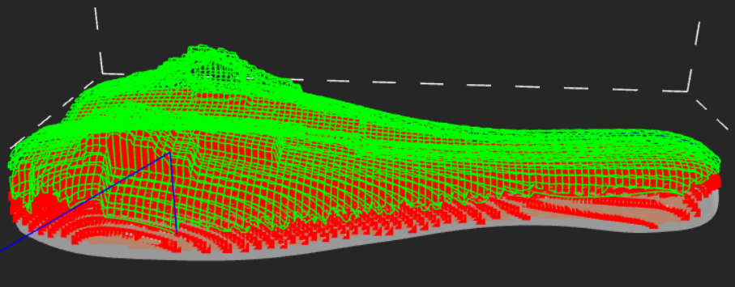

# Settings
 - `selection settings` folder:
    - `toolMode`: asso (free draw); box (rectangular draw)
    - `selectionMode`: centroid-visible (only select the visible part of the mesh, i.e. front part); intersection/centroid (also selects non-visible mesh)
    - `selectModel`: If checked, select the whole model
    - `liveUpdate`: If checked, live update the selected mesh and toolpath when lasso/box selection changes.
    - `selectWireframe`: If checked, show the selected mesh's wireframe.
- `printer settings` folder:
    - `bedTemp`: Bed temperature.
    - `nozzleLeftTemp`: Left extruder temperature.
    - `nozzleRightTemp`: Right extruder temperature.
    - `machineDepth`: The max width (in mm) of the print space.
    - `machineDepthY`: The max length (in mm) of the print space.
    - `machineHeight`: The max height (in mm) of the print space.
    - `dieSwelling`: The die swelling factor.
    - `nozzleDiameter`: The diameter of the printer's nozzle.
    - `filamentDiameter`: The diameter of the filament being used.
    - `nozzleLength`: The length of the nozzle from the tip to the base of the print head.
    - `printHead Max/Min X/Y`: The corners defining the dimensions of the printHeads width and length (in mm). The coordinates(0, 0) are the position of the nozzle. This is used for collision detection.
- `slicer settings` folder:
    - `useFermatSpirals`: If checked, infill patterns will be generated with fermat spirals. If not checked the slicer will generate a rectilinear pattern.
    - `generateBoundary`: if checked, the printer will print a boundary around the model. If selected when augmenting, the printer will also pause the print after the boundary is made, so you can place your object in the and then resume the augmentation.
    - `purgeLine`: If checked, the slicer will generate a purge line.
    - `checkCollisions`: If checked, the slicer will check for collisions when augmenting and give a suggested H* value to avoid collisions. Note that this will make slicing take longer.
    - `bedLeveling`: If checked, the printer will probe the bed for automatic leveling.
    - `testSweep`: If checked, the printer will follow the toolpath without heating or extruding, allowing you to test if the print head will collide with your object safely.
# Print Parameters
- `params` folder:
    - `Layer Thickness (deltaZ)`: How far apart each layer should be from one another.
    - `Delta L`: How far apart infill lines should be from one anotherr
    - `Grid Size`: How far apart points should be sampled. Loewring this gives better accuracy but slower slicing times.
    - `V*`: The ratio of extrusion speed and movement speed ($V_{extrude} / V_{movement}$). 
    - `End V*`: When using a gradient, the V* value will get closer to End V* at darker sections on the gradient SVG. It will be closer to the regular V* value at lighter sections.
    - `H*`: The ratio of extrusion/nozzle height and thread diameter ($H_{nozzle} / D_{thread}$).
    - `End H*`: When using a gradient, the H* value will get closer to End H* at darker sections on the gradient SVG. It will be closer to the regular H* value at lighter sections.
    - `Edot`: The filament extrusion rate (in mm/min). Increasing this will increase both the extrusion speed and print head speed because they are in a ratio controlled by V*.
- `initial params` folder:
    - Most parameters will be the same as in the params folder, but instead they will control the parameters for the initial few layers.
    - `Layer Offset`: How far offset outwards the initial layer should be. This is used to potentially create a scaffold around the model when augmenting.
    - `Initial Foam Layers`: How many foam layers should be printing using the initial parameters before switching to the regular parameters.
- `augment settings` folder:
    - `Select Augment Model`: This button allows you to choose a model to augment your current model with. This allows you to customize the surface of your augment with any model. This will only work if the "curveAugment" option is selected.
    - `curveAugment`: If checked, the slicer will generate augmentations that curve into the selected augment model's shape. If checked but no model is selected, it will default to creating a flat surface.
    - `Foam Layers`: How many layers to generate for augmentations. The total number of layers generated will be Foam Layers + Initial Foam Layers under the initial params folder.
    - `Max Angle`: The max angle to generate augmentations on. This allows you to only augment on flatter surfaces so you can print lower to the model and get better results.
    - `Flat Layer Z Offset`: This controls how far above the model the default flat layer is when the curveAugment feature is enabled. This only has any effect when curveAugment is enabled but no augment model has been selected.
- `bump settings` folder:
    - `Select Bump Model`: This button lets you select a model to generate across the surface of your augmentation to improve grip.
    - `generateBumps`: If checked, generates bumps on the surface of any augmentation you generate.
    - `Bump Spacing X`: How far apart the center of the bumps are on the x axis (in mm).
    - `Bump Spacing Y`: How far apart the center of the bumps are on the y axis (in mm).
    - `Bump Scale`: The scale of the bump model.
- `gradient settings` folder:
    - `Select Gradient SVG`: Allows you to select an svg file to define a gradient of foam properties. The color of the svg corresponds to a percentage, with black being 100% and white being 0%. The higher the percentage, the closer the parameters are to End H* and end V* rather than H* and V*. Currently, it's only possible to make gradients across the x and y axis, not the z axis. 

> [!IMPORTANT]  
> Known bugs:
> - Fermat spiral infill overlaps for certain geometries.
> - Augmentation toolpaths are slightly bumpy.
> - Rectilinear paths go over holes in models and for certain geometries print outside of the model.